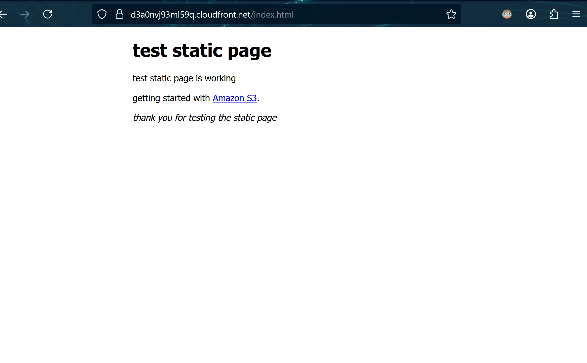

# 1-Host_static-webpage_S3_and_CloudFront
The objective for this project is to create a static webpage by leveraging S3 for file storage and CloudFront for fast global content delivery. This will provide practical hands-on experience working with the AWS storage and CDN services. You will also be able to examine different methods to securing a connection between S3 and CloudFront.
### Key Resources
- **Content Delivery Network (CDN)**: 
  - A CDN improves efficiency by introducing distributed intermediary servers between the client and the origin server. These CDN servers manage some of the communications by caching content closer to users. This decreases web traffic to the origin server and reduces bandwidth consumption while improving load times through reduced latency.
  - In addition, CDN provides benefits including scalability for handling traffic spikes, enhanced reliability through redundancy, and security features like DDoS protection.
- **S3 bucket**:
  - An S3 bucket is a container for storing objects used in Amazon Simple Storage Service (S3). An object is a file and any metadata that describes that file.
  - It offers scalable cloud storage with globally unique bucket names that can store unlimited objects.
- **S3 bucket policies**:
  - Bucket policies are JSON-based access control policies that manage access to S3 buckets and their objects. They define permissions and rules for accessing the bucket and its objects. They provide granular permissions that apply to all objects owned by the bucket owner. 
  - Being resource-based policies attached to the bucket itself, they enable cross-account access and centralized control. Bucket policies allow or deny requests based on policy elements including the requester, S3 actions, resources, and request conditions (such as IP address).
- **Securing access on a CDN-fronted S3 bucket**:
  - You can use secure CDN-fronted S3 bucket access using these methods: Restrict Access with Bucket Policies (allow only CDN IPs), Use Signed URLs (temporary access tokens), Enable Access Control Lists/ACLs (granular object permissions), Use Origin Access Identity/OAI (CloudFront-only access), Implement HTTPS (encrypted transit), and Monitor and Audit (CloudTrail logging for access tracking).
### Services
This project will allowed me to develop skills in several AWS services including:
- **S3**: Amazon S3, or Simple Storage Service, is a cloud storage service for storing and retrieving files, websites, backups, and data with high scalability and security.
- **CloudFront**: Global content delivery network (CDN) that speeds up websites, APIs, and content by storing copies at edge locations closer to users worldwide.
#### Visualization

### Capabilities
Working on this project was great for learning fundamentals of the AWS S3 and CloudFront services while gaining hands-on skills in essential cloud engineering tasks. Successfully hosting a static website using these services provided practical knowledge of cloud storage, content delivery networks, and security configurations. The project covered core infrastructure capabilities including:
- **Creating S3 bucket and importing a site**: Setting up cloud storage containers and uploading website files for web hosting.
- **Creating bucket policies**: Writing JSON-based access control rules to manage permissions and secure bucket content.
- **Creating a CloudFront distribution**: Implementing the global CDN service for caching and delivering content from edge locations.
- **Configuring orgin/configuring privacy settings**: Setting up source connections and implementing security controls for content access.
### Objectives
####  1. Create S3 bucket and upload a simple website.
####  2. Create a CloudFront distribution.
####  3. Setup bucket policies to restrict public access and only allow access from CloudFront.
### Questions
####  What does AWS Web Application Firewall (WAF) do and when should you use it?
- AWS WAF protects your web applications and resources from common web exploits and attacks by allowing you to monitor and manage web requests by filtering and blocking malicious http/https traffic. You can protect resources such as Amazon CloudFront distributions, Amazon API Gateway REST APIs, Application Load Balancers, and AWS AppSync GraphQL APIs.
- Consider using AWS WAF for defending against vulnerability attacks such as SQL injection, to block malicious bots and scrapers, enforce rate limits, restrict geographic access, and implement custom security policies for application-specific threats. Allows easy integration with existing AWS services like CloudFront, Application Load Balancer, or API Gateway for streamlined deployment.
#### What happens when a file is requested but is not cached at a CloudFront edge location?
- When CloudFront detects the content is missing in cache after the initial check, performs an origin request to retrieve the missing content from the source server. The fetched content is then stored in the edge cache with a standard 24-hour TTL expiration period. Popular content experiences extended cache duration through repeated access requests, optimizing delivery performance.
####  How is AWS Certificate Manager used to veryfy HTTPS SSL/TLS certificates?
- AWS Certificate Manager (ACM) streamlines the process of creating, storing, and renewing public and private SSL/TLS X.509 certificates and keys that protect your AWS websites and applications. You can provide certificates for your integrated AWS services by either requesting ACM to generate certificates automatically or by importing third-party certificates into the ACM management system.
 - Certificates must be in us-east-1 region for CloudFront, ACM certificates associated with CloudFront in this region are distributed to all the geographic locations configured for that distribution.
### References
- **CloudFront**: https://docs.aws.amazon.com/cloudfront/
- **What is CDN?**: https://aws.amazon.com/what-is/cdn/
- **S3 buckets**: https://docs.aws.amazon.com/AmazonS3/latest/userguide/UsingBucket.html
- **S3 bucket policies**: https://docs.aws.amazon.com/AmazonS3/latest/userguide/bucket-policies.html
- **CDN best practices**:https://docs.aws.amazon.com/whitepapers/latest/content-delivery-best-practices/
- **AWS WAF documentation**: https://docs.aws.amazon.com/waf/
- **CloudFront cache**: https://docs.aws.amazon.com/AmazonCloudFront/latest/DeveloperGuide/cache-hit-ratio.html
- **AWS Certificate Manager user guide**: https://docs.aws.amazon.com/acm/latest/userguide/
- **Using custom domain names**: https://docs.aws.amazon.com/AmazonCloudFront/latest/DeveloperGuide/CNAMEs.html
- **Geographic restrictions for optimiztion**: https://docs.aws.amazon.com/AmazonCloudFront/latest/DeveloperGuide/georestrictions.html
- **Orgin Access Identity**: https://docs.aws.amazon.com/AmazonCloudFront/latest/DeveloperGuide/private-content-restricting-access-to-s3.html
### Other Options
#### To use an alternate domain name (CNAME) instead of the default CloudFront domain name (such as d111111abcdef8.cloudfront.net), you must own the domain and provide a valid SSL certificate from ACM or a third-party provider that covers the alternate domain name. The certificate requirement ensures secure HTTPS connections and validates your ownership of the domain before CloudFront allows the CNAME association.
#### For enterprise-grade content delivery optimization, you can configure serveral CloudFront features to enable cost-effective, compliant, and resilient global content delivery. Some features include: Price Class Selection to balance cost and performance by choosing which geographic regions serve content, Geographic Restrictions to comply with licensing and regulatory requirements, Custom Error Pages to maintain brand consistency during outages, and Multiple Origins to optimize content delivery and implement high availability through failover.
#### CloudFront Origin Access Identity (OAI) is a special CloudFront user that you associate with your distribution to securely serve content from an S3 bucket, ensuring all access flows exclusively through CloudFront and blocking direct S3 access.
### Tips
- Use long TTL for static assets (CSS, JS, images) since they rarely change, and shorter TTL for HTML files that update more frequently.
- S3 bucket policies with the aws:Referer condition provide basic security by preventing other websites from directly accessing your S3 content. However, since referer headers can be easily spoofed, this method is not foolproof. For robust security, use Origin Access Identity (OAI) instead.