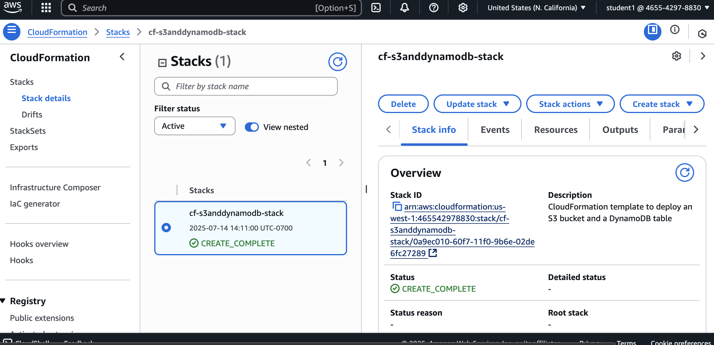

# Deploy CloudFormation template from AWS console
This project deploys AWS resources using CloudFormation by creating a stack from a template stored in an S3 bucket for centralized management and versioning. The project demonstrates best practices and proper implementation techniques for CloudFormation deployments. Key learning areas include creating CloudFormation templates, implementing deployment error handling features, and applying security configurations during resource provisioning.
### Key Resources
- **Infrastructure as Code (IaC)**: 
  - IaC manages infrastructure through code files instead of manual processes, treating configuration files like source code to provision resources (servers, networking, storage) in a repeatable way.
  - IaC tools use various languages and can be developed like application code with IDE support, version control, and integration into the main codebase.
  - Two approaches: Declarative defines the desired end state, while imperative defines the step-by-step process to achieve that state.
- **Cloudformation Template**:
  - A CloudFormation template is a JSON or YAML file that declaratively defines AWS resources, their properties, and dependencies.
  - Every CloudFormation template consists of six main sections: Resources (defines the AWS resources to create), Parameters (input values for customization), Outputs (return values from the stack), Metadata and Rules (additional information and validation logic), Conditions (conditional resource creation), and Transform (template preprocessing with macros like SAM).
- **how do you define a cloudformation stack**:
  - A stack is a collection of AWS resources that you can manage as a single unit. You can make changes to a collection of resources by creating, updating, and deleting stacks.
  - Creating a stack involves deploying a CloudFormation template that specifies the resources and their configurations. Updating a stack compares the changes you submit with the current state of your stack, and updates only the changed resources. Deleting a stack deletes the resources associated with it.
### Services
This project will allowed me to develop skills in several AWS services including:
- **Cloudformation**: Infrastructure as Code service that provisions and manages AWS resources using templates.
- **S3**: bject storage service for storing and retrieving files, data, and static content.
- **DynamoDB**: Fully managed NoSQL database service for fast and predictable performance.
#### Visualization

### Capabilities
Working on this project provided an opportunity to gain experience focusing on learning CloudFormation fundamentals and deployment processes while developing essential cloud engineering skills:
- **Creating a CloudFormation template**: Define AWS resources using JSON or YAML configuration files.
- **Uploading template to S3**: Store template files in S3 for centralized management.
- **Initializing template to create a stack**: Deploy the template to provision resources as a single unit, creating a stack.
- **Checking services created**: Verifying that all specified AWS resources were successfully created and operational.
### Objectives
####  1. Download a template from link provided
####  2. Create S3 bucket and upload template
####  3. Create Cloudformation and attach template from S3 bucket
####  4. Allow Cloudformation to create the stack, confirm services are running once complete
####  5. Delete the Cloudformation stack and check to see that services attached are deleted
### Questions
####  Can CloudFormation templates be deployed in multiple environments or regions?
- CloudFormation templates are region-agnostic and reusable across multiple regions assuming the resources that are being deployed are avaiable in the target region.
- Successful deployment also requires that the AWS services defined in the template are available in the target region, region-specific resources (like AMI IDs) are parameterized, and service limits and quotas are sufficient.
####  What are Cloudformation StackSets?
- StackSets serves as a container for multiple stacks that are deployed across specified AWS accounts and Regions. Each stack is based on the same CloudFormation template but allow customization with parameters.
- StackSets also allow you to specify operation preferences; examples include regional deployment sequence, failure tolerance before stopping operations, and maximum concurrent account executions.
- StackSets are region-specific resources that can only be managed from their original region.
####  What are Cloudformation modules?
- Modules can encapsulate resource configurations for inclusion across stack templates, in a transparent, manageable, and repeatable way. Modules can be used as customizable building blocks for you to include in your stack templates.
- These modules support single or multiple resources and can be nested together, allowing you to build layered best-practice architectures.
- Modules are available in the CloudFormation registry, so you can use them just like a native resource.
- Modules offer four key advantages: predictable resource schemas, reusability across environments, automatic change traceability, and centralized registry management.
#### Do resources get deleted along with their CloudFormation stack?
- By default, all AWS resources created by a CloudFormation stack are automatically deleted when the stack is deleted. However, resources can be configured with deletion policies to prevent automatic deletion.
### References
- **IaC**: https://aws.amazon.com/what-is/iac/
- **Cloudformation resource guide**: https://docs.aws.amazon.com/AWSCloudFormation/latest/TemplateReference/introduction.html
- **Cloudformation stack**: https://docs.aws.amazon.com/AWSCloudFormation/latest/UserGuide/stacks.html
- **Cloudformation template deployment best practices**: https://docs.aws.amazon.com/AWSCloudFormation/latest/UserGuide/best-practices.html
- **AWS Cloudformation StackSets**: https://docs.aws.amazon.com/AWSCloudFormation/latest/UserGuide/stacksets-concepts.html
- **Creating AWS Cloudformation resource modules**: https://docs.aws.amazon.com/AWSCloudFormation/latest/UserGuide/modules.html
- **Cloudformation console create stack**: https://docs.aws.amazon.com/AWSCloudFormation/latest/UserGuide/cfn-console-create-stack.html
### Other Options
#### Leaving the template options at default when creating a CloudFormation stack was appropriate for this project. However, you can customize several options based on your stack requirements. These options include tags for organizing and tracking resources, permissions for setting IAM roles during stack operations, stack policies for controlling resource update permissions, notifications for enabling SNS event alerts, and termination protection for preventing accidental stack deletion. 
#### The default failure option is "rollback on failure," which automatically deletes all successfully created resources if stack creation fails. The alternative option is "preserve successfully provisioned resources," which retains resources that were created before the failure occurred. Additional rollback configuration includes CloudWatch alarms that can trigger automatic rollback during stack creation or updates, and timeout settings that specify the maximum time allowed before rollback occurs
#### JSON vs YAML: JSON offers strict syntax validation and universal tool support, making it more compact and faster to parse. JSON is ideal for programmatic generation and API interactions. YAML provides better human readability with its indentation-based syntax structure and support for comments, making it more intuitive for complex configurations and collaborative development. YAML is preferred for manual editing and documentation.
### Tips
- Implement proper resource naming conventions with consistent prefixes and suffixes.
- Use IAM roles instead of embedding credentials in templates.
