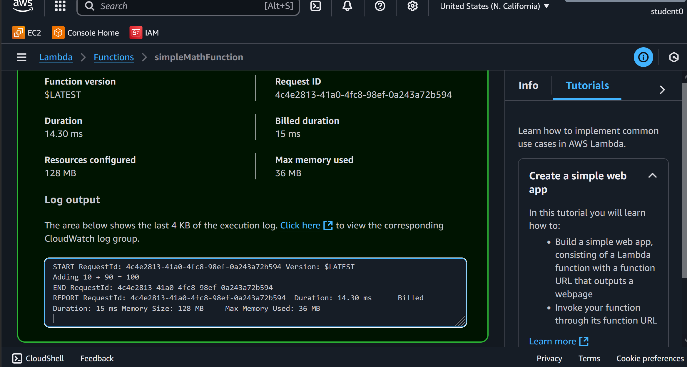

# Create a Simple Lambda Function
This project creates a basic AWS Lambda function in Python that adds two numbers from input parameters and returns the result. It serves as an introductory hands-on experience to understand Lambda fundamentals, explore serverless capabilities, and learn deployment processes through practical implementation.
### Key Resources
- **Function as a Service**: 
  - Function as a Service (FaaS) is a computing model that runs code without managing servers. AWS Lambda provides this service, where the cloud provider handles all server management, allowing developers to focus solely on writing code.
  - It features event-driven execution that triggers code only when events occur, and features automatic scaling that adjusts resources based on demand for optimal cost efficiency.
- **Lambda Function Specifications**: 
  - It supports a Maximum Memory of 128 MB to 10,240 MB (10 GB) in 1 MB increments. The memory allocation directly affects CPU power and network bandwidth.
  - Lambda's basic execution policy provides minimum permissions for function execution and CloudWatch logging, enabling output capture, error tracking, debugging support, and monitoring capabilities.
- **Cloudwatch logs**:
 - By default Lambda automatically captures logs for all function invocations and sends them to Cloudwatch logs provided your functions role has the necessary permissions.
 - To enhance debugging, you can insert custom logging statements into your code, which Lambda will seemlessly integreate with Cloudwatch logs
 - Lambda automatically creates a Cloudwatch log group and the logs will include the following components: START, END, REPORT, ERROR.
 - The execution role you assign for your Lambda function needs the following permissions to upload logs to CloudWatch Logs: logs:CreateLogGroup, logs:CreateLogStream, and logs:PutLogEvents
### Services
This project will allowed me to develop skills in several AWS services including:
- **Lambda**: Serverless compute service that runs code in response to events.
- **Cloudwatch**: Monitoring and observability service that collects metrics, logs, and events from AWS resources.
- **Cloudshell**: Browser-based shell environment that provides command-line access.
#### Visualization

### Capabilities
Working on this project served as an introduction to AWS Lambda and provided an opportunity to gain experience in performing engineering tasks for the cloud including:
- **Creating a Lambda Function**: Learning serverless function fundamentals and deployment.
- **Writing a Python Program**: Developing basic computation logic for Lambda execution.
- **Error Checking with Logs**: Debugging, monitoring function performance, and troubleshooting issues.
- **Manage IAM Permissions**: Configuring proper execution roles and policies.
- **Invoke a Lambda Function in AWS CLI**: Testing function execution and handling responses.
### Objectives
####  1. Create a Lambda function
####  2. Create a python script
####  3. Check logs in Cloudwatch
####  4. Test invoking function in Cloudshell
### Questions
####  What are some uses of Lambda Functions?
- AWS Lambda functions serve multiple purposes including API backends for HTTP requests, data processing for S3 files and database changes, real-time analytics with streaming data, scheduled tasks via EventBridge, microservices components, image/video processing, and IoT data handling.
####  What is the typical structure of a lambda function?
- Lambda functions require a handler function with the signature def lambda_handler(event, context), where the event parameter contains input data from trigger sources like API Gateway or S3, while the context parameter provides runtime information about the function execution environment. The return format varies based on integration type with different formats for API Gateway integration versus direct invocation, and robust error handling with try-catch blocks is essential to ensure reliable execution and proper error responses.
####  What are cost considerations for executing lambda functions?
- AWS Lambda uses a pay-per-use pricing model based on execution time and memory allocation. The service includes a free tier offering 1 million requests and 400,000 GB-seconds per month. To optimize costs, it's recommended to right-size memory allocation to balance performance requirements with cost efficiency.
####  How to a invoke Lambda function in Cloudshell with base64 encoding?
- AWS CLI and Lambda both encode data, causing corruption. Add the --cli-binary-format raw-in-base64-out flag when invoking functions. Implement defensive coding in your Lambda function to detect and handle both base64-encoded and plain text inputs, ensuring compatibility.
### References
- **Project Reference**: https://github.com/shubhammurti/AWS-Projects-Portfolio/blob/main/Level%20100/10.%20Create%20a%20Lambda%20to%20add%202%20numbers/LES01-AWS100%20-%20Create%20a%20Lambda%20to%20add%202%20numbers.md
- **Lambda Function**: https://docs.aws.amazon.com/lambda/latest/dg/welcome.html
- **Lambda Function quotas**: https://docs.aws.amazon.com/lambda/latest/dg/gettingstarted-limits.html 
- **Lambda role, basic execution policy**: https://repost.aws/questions/QUxTLQWN2CTDmcyf1FxxQxyA/minimum-permissions-to-deploy-a-lambda-function
- **Cloudwatch**: https://docs.aws.amazon.com/lambda/latest/dg/monitoring-cloudwatchlogs.html
- **Lambda Python handler**: https://docs.aws.amazon.com/lambda/latest/dg/lambda-python.html
- **Cloudshell base64 encoding**: https://docs.aws.amazon.com/cli/latest/userguide/cli-usage-parameters-types.html#parameter-type-blobs
- **IAM Identity Center**:
- **Lambda runtime**: https://docs.aws.amazon.com/lambda/latest/dg/lambda-runtimes.html
- **Deploying lambda functions**: https://docs.aws.amazon.com/lambda/latest/dg/configuration-function-zip.html
- **Invoking Lambda funtions**: https://docs.aws.amazon.com/cli/latest/reference/lambda/invoke.html
- **AWS Toolkit**:https://docs.aws.amazon.com/toolkit-for-vscode/latest/userguide/welcome.html
### Other Options
#### AWS Lambda supports multiple programming languages including Python, Node.js, Java, and C#.
#### You can deploy Lambda functions using the AWS Management Console, AWS CLI, Infrastructure as Code (IaC), CI/CD pipelines, serverless frameworks, IDE integration, and container images.
#### IAM vs IAM Identity Center: IAM manages users and permissions within a single AWS account by attaching policies directly to individual users, making it ideal for small teams. In contrast, IAM Identity Center provides centralized identity management across multiple AWS accounts using reusable permission sets that can be assigned to users or groups across all accounts and regions simultaneously. This approach includes single sign-on capabilities and temporary credentials, making it designed for enterprise environments with complex organizational structures.
#### Direct Payload vs File Payload: When invoking Lambda functions, direct payloads work well for quick testing with simple JSON objects but are constrained by command line length limits and lack version control capabilities. File-based payloads offer a more robust solution for complex data structures and automated workflows, supporting up to 6MB of data while enabling reusability across invocations and version control tracking, making them essential for CI/CD pipelines and comprehensive test suites.
### Tips
- The AWS Toolkit IDE solution lets you work with Lambda functions directly in your code editor. Install the extension, connect your AWS account, and you can build, test, and upload Lambda functions all from VS Code. This saves time by keeping everything in one place instead of switching between your editor and the AWS website.
- AWS Lambda is a regional service and functions should be deployed in the same region as the services they primarily interact with to minimize latency and costs.
- IAM policies are preferred over access keys for Lambda because they use temporary, auto-rotating credentials with centralized management, while access keys use permanent credentials requiring manual rotation.
- When invoking command using a file, use fileb:// for binary data instead of file:// for text data.