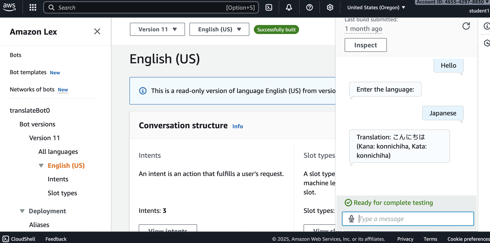

# Build a Language Translation Bot Using Lex
This project creates a conversational language translation application using AWS services. The bot accepts text input through Amazon Lex's chat interface and translates it to a desired target language using Amazon Translate. AWS Lambda serves as the integration layer, executing the translation logic and connecting the services. I also decided to add a deployment package with the jaconv external library to convert Japanese text to Roman letters, which provided me with hands-on experience in Lambda package management and dependency handling.
### Key Resources
- **AWS Lambda function**:
  - You can use AWS Lambda functions to extend and better control behavior of your Amazon Lex bot
  - Make sure that the function returns a structure matching the response format which consists of the fields in the Lambda function response and to determine which parameters you want to manipulate.
  - Associate the Lambda function with a Amazon Lex V2 bot alias with the console or API operations. Amazon Lex V2 uses one Lambda function per bot alias per language instead of one Lambda function for each intent
- **Amazon Lex bot**: 
  - **Intents**: Goals that you want your bot to accomplish; at least one intent is required for every bot. The structure of an Intent includes the initial response, slots, confirmation, fulfillment, and the closing response.
  - **Slot Types**: Values that are provided by the user to fulfill the Intent. There are two types of slots: Built-in slot types, which are used to capture standard values such as number, name, and city; and Custom slot types, which can be used to capture custom values specific to the intent.
- **Amazon Translate**:
  - A text translation service that uses advanced machine learning to provide high-quality translation on demand
  - Allows you to translate from a specifed supported source language or a can automatically detect the source text using automatic laguage detection
  - Supports the following formats: inpute text, one input file, and collection of input files.
- **External Library Integration**:
  - jaconv for Japanese romanization via deployment package
### Services
This project will allowed me to develop skills in several AWS services including:
- **Lambda**: Serverless compute platform that executes code in response to events.
- **Lex**: Conversational AI service that builds chatbots with features added through intents and slot types.
- **Translate**: Text translation services that converts text between 75+ languages.
- **Comprehend**: Natural language processing service the extracts insights from text.
#### Visualization

### Capabilities
This project served as an introduction for me to learn about Amazon Lex and AI-powered AWS services, demonstrating how to integrate conversational AI with core AWS infrastructure. This hands-on experience covered essential cloud engineering practices including:
- **Lambda Integration**: Create lambda function to perform translate when integrate with lex bot.
- **Function Testing**: Testing lambda function using JSON test events.
- **Bot Development**: Create lex bot for chat interface.
- **Bot Validation**: Peform testing for bot to verify that it is working correctly.
- **Monitor & Debugging**: Using Cloudwatch for error handling and checking for messages in logs.
- **Package Management**: Using external library for additional translate capabilities, creating deployment package.
- **Security Configuration**: Security management with setting permissions for user access to services and permissions for resources.
### Objectives
#### 1. Set up AWS Services
#### 2. Create an Amazon Lex Bot
#### 3. Create an Intent
#### 4. Create two slots: "text" (AMAZON.AlphaNumeric) and "language" (AMAZON.Language)
#### 5. Create a Lambda Function
#### 6. Create deployment package to include external library
#### 7. Configure Lambda Function Code
#### 8. Set Up IAM Permissions
#### 9. Connect Lex to Lambda
#### 10. Test and Refine
#### 11. Deploy the Bot
### Questions
#### What are Amazon Resource Names?
- Amazon Resource Names (ARN) are a unique identifier for AWS resources, it can be used for specifying a resource unambiguously across all of AWS, such as in IAM policies, Amazon Relational Database Service (Amazon RDS) tags, and API calls.
#### What is the difference between Source ARN and Resource ARN in IAM policies?
- In IAM policies, Source ARN specifies who can invoke the function whereas Resource ARN specifies what resource the policy applies to. In Lambda resource-based policies, source ARN provide better security by restricting to which specific resource is allowed to to call your Lambda function.
#### Is Amazon Lex included in free Tier?
- Amazon Lex is included in the AWS Free Tier with 10,000 text requests and 5,000 speech requests per month for the first 12 months from account creation. This includes features such as text and voice interactions, built-in intents and slot types, integration with Lambda functions, and basic bot building features.
#### Is the Lex bot Language slot type available in all regions?
- The AMAZON.language built-in slot type is not available in the us-west-1 (N. California) region.
### References
- **Integrating an AWS Lambda function into your bot**: https://docs.aws.amazon.com/lexv2/latest/dg/lambda.html
- **Working with Amazon Lex V2 bots**: https://docs.aws.amazon.com/lexv2/latest/dg/building-bots.html
- **What is Amazon Translate?**: https://docs.aws.amazon.com/translate/latest/dg/what-is.html
- **Identify AWS resources**: https://docs.aws.amazon.com/IAM/latest/UserGuide/reference-arns.html
- **Viewing resource-based IAM policies in Lambda**: https://docs.aws.amazon.com/lambda/latest/dg/access-control-resource-based.html
- **jaconv**: https://pypi.org/project/jaconv/
- **Amazon Lex features**: https://aws.amazon.com/lex/features/?nc=sn&loc=2#topic-0
- **Testing Lambda functions**: https://docs.aws.amazon.com/lambda/latest/dg/testing-functions.html
- **Deploying Lambda functions**: https://docs.aws.amazon.com/lambda/latest/dg/configuration-function-zip.html
### Other Options
#### Japanese Text Processing Libraries - Pykakasi vs Jaconv
- Both Pykakasi and Jaconv are python libraries for converting Japanese text to Romanized form. The biggest difference is that the primary function for Jaconv is to interconvert between Hiragana, Katakana, and full-width/half-width characters.
#### Generate utterances for Lex bot with Amazon Bedrock
- Amazon Bedrock integration with Lex enables AI-power utterance generation though the descriptive bot builder feature with uses generative AI to create sample utterances automatically. This feature is not included in free tier and will require separate pricing to use the Bedrock service.
### Tips
- JSON test events - A test event is a JSON input to your function, it can be used to test your Lambda Function to validate if it is working correctly. When you run a test in the console, Lambda synchronously invokes your function with the test event. 
- Creating a deployment package - A deployment package bundles your Lambda function code with external dependencies, or libraries not included in Lambda's default runtime, into a single ZIP file for upload. Follow the steps for creating a deployment package in this link: https://docs.aws.amazon.com/lambda/latest/dg/configuration-function-zip.htmls